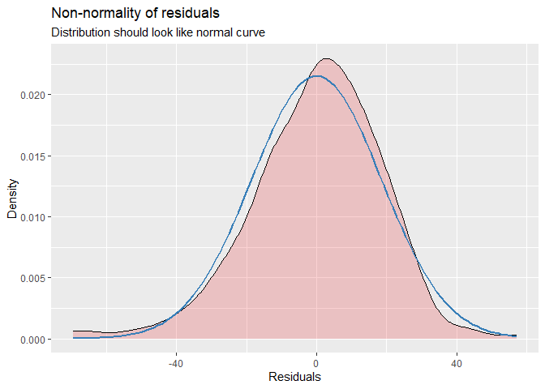
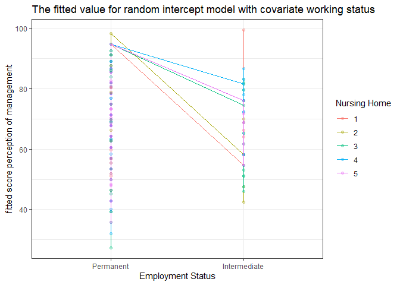

# 1.0 Introduction

Many designs in educational research generate multilevel data, which presents unique challenges for researchers. Multilevel data often arise from "nested" data structures, where observations are nested within larger units. For example, in longitudinal educational research, repeated measures are nested within individuals, creating a multilevel data structure.

The primary issue with nested data structures is that they violate the independence assumption required by classic statistical techniques such as ANOVA and OLS multiple regression. This violation can lead to excessive Type I errors and biased parameter estimates when using these traditional methods. To address these issues, multilevel modeling is often necessary. Multilevel modeling can account for the nested nature of the data, providing more accurate and reliable results by properly handling the dependencies within the data.

# 2.0 About the Data

The data comprises 288 participants distributed across five nursing homes in Norway. This data structure is nested because multiple staff members were sampled from each nursing home. Therefore, the data has two levels of sampling: Level 1 includes staff (each row in the dataset), and Level 2 includes nursing homes (represented by the column "nhid").

Given this nested structure, the dataset is suitable for hierarchical data analysis. In our linear mixed model, the dependent or outcome variable, perception of management (POM), is predicted by the fixed factors of position status (permanent [1] or intermediate [2]), working condition score (1-100), and Norwegian mother tongue status (yes [1] or no [2]).

# 3.0 Procedure

## 3.1 Creating Environment


``` r
library(tidyverse) # Data process
```

```
## ── Attaching core tidyverse packages ──────────────────────── tidyverse 2.0.0 ──
## ✔ dplyr     1.1.4     ✔ readr     2.1.5
## ✔ forcats   1.0.0     ✔ stringr   1.5.1
## ✔ ggplot2   3.5.1     ✔ tibble    3.2.1
## ✔ lubridate 1.9.3     ✔ tidyr     1.3.1
## ✔ purrr     1.0.2     
## ── Conflicts ────────────────────────────────────────── tidyverse_conflicts() ──
## ✖ dplyr::filter() masks stats::filter()
## ✖ dplyr::lag()    masks stats::lag()
## ℹ Use the conflicted package (<http://conflicted.r-lib.org/>) to force all conflicts to become errors
```

``` r
library(lme4) # for linear-mixed model
```

```
## Loading required package: Matrix
## 
## Attaching package: 'Matrix'
## 
## The following objects are masked from 'package:tidyr':
## 
##     expand, pack, unpack
```

``` r
library(lmerTest) # Estimation for linear-mixed model 
```

```
## 
## Attaching package: 'lmerTest'
## 
## The following object is masked from 'package:lme4':
## 
##     lmer
## 
## The following object is masked from 'package:stats':
## 
##     step
```

``` r
library(gtsummary) # tabulation
library(broom.mixed) # better result
library(kableExtra) # tabulation 
```

```
## 
## Attaching package: 'kableExtra'
## 
## The following object is masked from 'package:dplyr':
## 
##     group_rows
```

``` r
library(merTools) #visualizing, and interpreting mixed-effects models
```

```
## Loading required package: arm
## Loading required package: MASS
## 
## Attaching package: 'MASS'
## 
## The following object is masked from 'package:gtsummary':
## 
##     select
## 
## The following object is masked from 'package:dplyr':
## 
##     select
## 
## 
## arm (Version 1.14-4, built: 2024-4-1)
## 
## Working directory is C:/Users/ACER/Desktop/Corr_Num_Assignment
```

``` r
library(lattice) # Data visualisation
library(haven) # read foreign data
library(prettydoc) # nicer knitted document
```

## 3.2 Load the data into R environment


``` r
data <- read_sav("data.sav")
```

## 3.3 Data Wrangling


``` r
data <- data %>% 
  mutate_if(is.labelled, as.factor) %>% 
  dplyr::select(nhid,status,mothert,scorewc,scorepom)  %>%
  mutate(status = recode(status, `1` = "Permanent", `2` = "Intermediate")) %>% 
         mutate(mothert = recode(mothert,`1` = "Present", `2` = "Absent" ))
glimpse(data)
```

```
## Rows: 288
## Columns: 5
## $ nhid     <chr> "1", "1", "1", "4", "5", "5", "2", "2", "3", "4", "1", "4", "…
## $ status   <fct> Permanent, Permanent, Permanent, Permanent, Permanent, Perman…
## $ mothert  <fct> Present, Present, Present, Present, Present, Absent, Absent, …
## $ scorewc  <dbl> 75.00000, 66.66667, 50.00000, 66.66667, 58.33333, 30.00000, 3…
## $ scorepom <dbl> 50.00000, 75.00000, 85.01667, 58.33333, 62.50000, 16.66667, 5…
```

## 3.4 Exploratory Data Analysis

### Table 1 Characteristic of Respondents


``` r
data %>% tbl_summary(label = list(nhid ~ "Nursing Home", 
                                  status ~ "Employment Status", 
                                  mothert~"Norwegian Mother Tongue Status", 
                                  scorewc ~ "Score of Working Condition", 
                                  scorepom~'Score of Perception of Management'), 
                     type = list(where(is.logical) ~ "categorical")) %>% 
  modify_caption("**Table 1.Characteristic of Respondents**")  %>%
  modify_header(label ~ "**Characteristics**") %>% 
  bold_labels()
```

```{=html}
<div id="rrrbjhajqu" style="padding-left:0px;padding-right:0px;padding-top:10px;padding-bottom:10px;overflow-x:auto;overflow-y:auto;width:auto;height:auto;">
<style>#rrrbjhajqu table {
  font-family: system-ui, 'Segoe UI', Roboto, Helvetica, Arial, sans-serif, 'Apple Color Emoji', 'Segoe UI Emoji', 'Segoe UI Symbol', 'Noto Color Emoji';
  -webkit-font-smoothing: antialiased;
  -moz-osx-font-smoothing: grayscale;
}

#rrrbjhajqu thead, #rrrbjhajqu tbody, #rrrbjhajqu tfoot, #rrrbjhajqu tr, #rrrbjhajqu td, #rrrbjhajqu th {
  border-style: none;
}

#rrrbjhajqu p {
  margin: 0;
  padding: 0;
}

#rrrbjhajqu .gt_table {
  display: table;
  border-collapse: collapse;
  line-height: normal;
  margin-left: auto;
  margin-right: auto;
  color: #333333;
  font-size: 16px;
  font-weight: normal;
  font-style: normal;
  background-color: #FFFFFF;
  width: auto;
  border-top-style: solid;
  border-top-width: 2px;
  border-top-color: #A8A8A8;
  border-right-style: none;
  border-right-width: 2px;
  border-right-color: #D3D3D3;
  border-bottom-style: solid;
  border-bottom-width: 2px;
  border-bottom-color: #A8A8A8;
  border-left-style: none;
  border-left-width: 2px;
  border-left-color: #D3D3D3;
}

#rrrbjhajqu .gt_caption {
  padding-top: 4px;
  padding-bottom: 4px;
}

#rrrbjhajqu .gt_title {
  color: #333333;
  font-size: 125%;
  font-weight: initial;
  padding-top: 4px;
  padding-bottom: 4px;
  padding-left: 5px;
  padding-right: 5px;
  border-bottom-color: #FFFFFF;
  border-bottom-width: 0;
}

#rrrbjhajqu .gt_subtitle {
  color: #333333;
  font-size: 85%;
  font-weight: initial;
  padding-top: 3px;
  padding-bottom: 5px;
  padding-left: 5px;
  padding-right: 5px;
  border-top-color: #FFFFFF;
  border-top-width: 0;
}

#rrrbjhajqu .gt_heading {
  background-color: #FFFFFF;
  text-align: center;
  border-bottom-color: #FFFFFF;
  border-left-style: none;
  border-left-width: 1px;
  border-left-color: #D3D3D3;
  border-right-style: none;
  border-right-width: 1px;
  border-right-color: #D3D3D3;
}

#rrrbjhajqu .gt_bottom_border {
  border-bottom-style: solid;
  border-bottom-width: 2px;
  border-bottom-color: #D3D3D3;
}

#rrrbjhajqu .gt_col_headings {
  border-top-style: solid;
  border-top-width: 2px;
  border-top-color: #D3D3D3;
  border-bottom-style: solid;
  border-bottom-width: 2px;
  border-bottom-color: #D3D3D3;
  border-left-style: none;
  border-left-width: 1px;
  border-left-color: #D3D3D3;
  border-right-style: none;
  border-right-width: 1px;
  border-right-color: #D3D3D3;
}

#rrrbjhajqu .gt_col_heading {
  color: #333333;
  background-color: #FFFFFF;
  font-size: 100%;
  font-weight: normal;
  text-transform: inherit;
  border-left-style: none;
  border-left-width: 1px;
  border-left-color: #D3D3D3;
  border-right-style: none;
  border-right-width: 1px;
  border-right-color: #D3D3D3;
  vertical-align: bottom;
  padding-top: 5px;
  padding-bottom: 6px;
  padding-left: 5px;
  padding-right: 5px;
  overflow-x: hidden;
}

#rrrbjhajqu .gt_column_spanner_outer {
  color: #333333;
  background-color: #FFFFFF;
  font-size: 100%;
  font-weight: normal;
  text-transform: inherit;
  padding-top: 0;
  padding-bottom: 0;
  padding-left: 4px;
  padding-right: 4px;
}

#rrrbjhajqu .gt_column_spanner_outer:first-child {
  padding-left: 0;
}

#rrrbjhajqu .gt_column_spanner_outer:last-child {
  padding-right: 0;
}

#rrrbjhajqu .gt_column_spanner {
  border-bottom-style: solid;
  border-bottom-width: 2px;
  border-bottom-color: #D3D3D3;
  vertical-align: bottom;
  padding-top: 5px;
  padding-bottom: 5px;
  overflow-x: hidden;
  display: inline-block;
  width: 100%;
}

#rrrbjhajqu .gt_spanner_row {
  border-bottom-style: hidden;
}

#rrrbjhajqu .gt_group_heading {
  padding-top: 8px;
  padding-bottom: 8px;
  padding-left: 5px;
  padding-right: 5px;
  color: #333333;
  background-color: #FFFFFF;
  font-size: 100%;
  font-weight: initial;
  text-transform: inherit;
  border-top-style: solid;
  border-top-width: 2px;
  border-top-color: #D3D3D3;
  border-bottom-style: solid;
  border-bottom-width: 2px;
  border-bottom-color: #D3D3D3;
  border-left-style: none;
  border-left-width: 1px;
  border-left-color: #D3D3D3;
  border-right-style: none;
  border-right-width: 1px;
  border-right-color: #D3D3D3;
  vertical-align: middle;
  text-align: left;
}

#rrrbjhajqu .gt_empty_group_heading {
  padding: 0.5px;
  color: #333333;
  background-color: #FFFFFF;
  font-size: 100%;
  font-weight: initial;
  border-top-style: solid;
  border-top-width: 2px;
  border-top-color: #D3D3D3;
  border-bottom-style: solid;
  border-bottom-width: 2px;
  border-bottom-color: #D3D3D3;
  vertical-align: middle;
}

#rrrbjhajqu .gt_from_md > :first-child {
  margin-top: 0;
}

#rrrbjhajqu .gt_from_md > :last-child {
  margin-bottom: 0;
}

#rrrbjhajqu .gt_row {
  padding-top: 8px;
  padding-bottom: 8px;
  padding-left: 5px;
  padding-right: 5px;
  margin: 10px;
  border-top-style: solid;
  border-top-width: 1px;
  border-top-color: #D3D3D3;
  border-left-style: none;
  border-left-width: 1px;
  border-left-color: #D3D3D3;
  border-right-style: none;
  border-right-width: 1px;
  border-right-color: #D3D3D3;
  vertical-align: middle;
  overflow-x: hidden;
}

#rrrbjhajqu .gt_stub {
  color: #333333;
  background-color: #FFFFFF;
  font-size: 100%;
  font-weight: initial;
  text-transform: inherit;
  border-right-style: solid;
  border-right-width: 2px;
  border-right-color: #D3D3D3;
  padding-left: 5px;
  padding-right: 5px;
}

#rrrbjhajqu .gt_stub_row_group {
  color: #333333;
  background-color: #FFFFFF;
  font-size: 100%;
  font-weight: initial;
  text-transform: inherit;
  border-right-style: solid;
  border-right-width: 2px;
  border-right-color: #D3D3D3;
  padding-left: 5px;
  padding-right: 5px;
  vertical-align: top;
}

#rrrbjhajqu .gt_row_group_first td {
  border-top-width: 2px;
}

#rrrbjhajqu .gt_row_group_first th {
  border-top-width: 2px;
}

#rrrbjhajqu .gt_summary_row {
  color: #333333;
  background-color: #FFFFFF;
  text-transform: inherit;
  padding-top: 8px;
  padding-bottom: 8px;
  padding-left: 5px;
  padding-right: 5px;
}

#rrrbjhajqu .gt_first_summary_row {
  border-top-style: solid;
  border-top-color: #D3D3D3;
}

#rrrbjhajqu .gt_first_summary_row.thick {
  border-top-width: 2px;
}

#rrrbjhajqu .gt_last_summary_row {
  padding-top: 8px;
  padding-bottom: 8px;
  padding-left: 5px;
  padding-right: 5px;
  border-bottom-style: solid;
  border-bottom-width: 2px;
  border-bottom-color: #D3D3D3;
}

#rrrbjhajqu .gt_grand_summary_row {
  color: #333333;
  background-color: #FFFFFF;
  text-transform: inherit;
  padding-top: 8px;
  padding-bottom: 8px;
  padding-left: 5px;
  padding-right: 5px;
}

#rrrbjhajqu .gt_first_grand_summary_row {
  padding-top: 8px;
  padding-bottom: 8px;
  padding-left: 5px;
  padding-right: 5px;
  border-top-style: double;
  border-top-width: 6px;
  border-top-color: #D3D3D3;
}

#rrrbjhajqu .gt_last_grand_summary_row_top {
  padding-top: 8px;
  padding-bottom: 8px;
  padding-left: 5px;
  padding-right: 5px;
  border-bottom-style: double;
  border-bottom-width: 6px;
  border-bottom-color: #D3D3D3;
}

#rrrbjhajqu .gt_striped {
  background-color: rgba(128, 128, 128, 0.05);
}

#rrrbjhajqu .gt_table_body {
  border-top-style: solid;
  border-top-width: 2px;
  border-top-color: #D3D3D3;
  border-bottom-style: solid;
  border-bottom-width: 2px;
  border-bottom-color: #D3D3D3;
}

#rrrbjhajqu .gt_footnotes {
  color: #333333;
  background-color: #FFFFFF;
  border-bottom-style: none;
  border-bottom-width: 2px;
  border-bottom-color: #D3D3D3;
  border-left-style: none;
  border-left-width: 2px;
  border-left-color: #D3D3D3;
  border-right-style: none;
  border-right-width: 2px;
  border-right-color: #D3D3D3;
}

#rrrbjhajqu .gt_footnote {
  margin: 0px;
  font-size: 90%;
  padding-top: 4px;
  padding-bottom: 4px;
  padding-left: 5px;
  padding-right: 5px;
}

#rrrbjhajqu .gt_sourcenotes {
  color: #333333;
  background-color: #FFFFFF;
  border-bottom-style: none;
  border-bottom-width: 2px;
  border-bottom-color: #D3D3D3;
  border-left-style: none;
  border-left-width: 2px;
  border-left-color: #D3D3D3;
  border-right-style: none;
  border-right-width: 2px;
  border-right-color: #D3D3D3;
}

#rrrbjhajqu .gt_sourcenote {
  font-size: 90%;
  padding-top: 4px;
  padding-bottom: 4px;
  padding-left: 5px;
  padding-right: 5px;
}

#rrrbjhajqu .gt_left {
  text-align: left;
}

#rrrbjhajqu .gt_center {
  text-align: center;
}

#rrrbjhajqu .gt_right {
  text-align: right;
  font-variant-numeric: tabular-nums;
}

#rrrbjhajqu .gt_font_normal {
  font-weight: normal;
}

#rrrbjhajqu .gt_font_bold {
  font-weight: bold;
}

#rrrbjhajqu .gt_font_italic {
  font-style: italic;
}

#rrrbjhajqu .gt_super {
  font-size: 65%;
}

#rrrbjhajqu .gt_footnote_marks {
  font-size: 75%;
  vertical-align: 0.4em;
  position: initial;
}

#rrrbjhajqu .gt_asterisk {
  font-size: 100%;
  vertical-align: 0;
}

#rrrbjhajqu .gt_indent_1 {
  text-indent: 5px;
}

#rrrbjhajqu .gt_indent_2 {
  text-indent: 10px;
}

#rrrbjhajqu .gt_indent_3 {
  text-indent: 15px;
}

#rrrbjhajqu .gt_indent_4 {
  text-indent: 20px;
}

#rrrbjhajqu .gt_indent_5 {
  text-indent: 25px;
}
</style>
<table class="gt_table" data-quarto-disable-processing="false" data-quarto-bootstrap="false">
  <caption><strong>Table 1.Characteristic of Respondents</strong></caption>
  <thead>
    <tr class="gt_col_headings">
      <th class="gt_col_heading gt_columns_bottom_border gt_left" rowspan="1" colspan="1" scope="col" id="&lt;strong&gt;Characteristics&lt;/strong&gt;"><strong>Characteristics</strong></th>
      <th class="gt_col_heading gt_columns_bottom_border gt_center" rowspan="1" colspan="1" scope="col" id="&lt;strong&gt;N = 288&lt;/strong&gt;&lt;span class=&quot;gt_footnote_marks&quot; style=&quot;white-space:nowrap;font-style:italic;font-weight:normal;&quot;&gt;&lt;sup&gt;1&lt;/sup&gt;&lt;/span&gt;"><strong>N = 288</strong><span class="gt_footnote_marks" style="white-space:nowrap;font-style:italic;font-weight:normal;"><sup>1</sup></span></th>
    </tr>
  </thead>
  <tbody class="gt_table_body">
    <tr><td headers="label" class="gt_row gt_left" style="font-weight: bold;">Nursing Home</td>
<td headers="stat_0" class="gt_row gt_center"><br /></td></tr>
    <tr><td headers="label" class="gt_row gt_left">    1</td>
<td headers="stat_0" class="gt_row gt_center">39 (14%)</td></tr>
    <tr><td headers="label" class="gt_row gt_left">    2</td>
<td headers="stat_0" class="gt_row gt_center">29 (10%)</td></tr>
    <tr><td headers="label" class="gt_row gt_left">    3</td>
<td headers="stat_0" class="gt_row gt_center">95 (33%)</td></tr>
    <tr><td headers="label" class="gt_row gt_left">    4</td>
<td headers="stat_0" class="gt_row gt_center">70 (24%)</td></tr>
    <tr><td headers="label" class="gt_row gt_left">    5</td>
<td headers="stat_0" class="gt_row gt_center">55 (19%)</td></tr>
    <tr><td headers="label" class="gt_row gt_left" style="font-weight: bold;">Employment Status</td>
<td headers="stat_0" class="gt_row gt_center"><br /></td></tr>
    <tr><td headers="label" class="gt_row gt_left">    Permanent</td>
<td headers="stat_0" class="gt_row gt_center">241 (84%)</td></tr>
    <tr><td headers="label" class="gt_row gt_left">    Intermediate</td>
<td headers="stat_0" class="gt_row gt_center">47 (16%)</td></tr>
    <tr><td headers="label" class="gt_row gt_left" style="font-weight: bold;">Norwegian Mother Tongue Status</td>
<td headers="stat_0" class="gt_row gt_center"><br /></td></tr>
    <tr><td headers="label" class="gt_row gt_left">    Present</td>
<td headers="stat_0" class="gt_row gt_center">233 (81%)</td></tr>
    <tr><td headers="label" class="gt_row gt_left">    Absent</td>
<td headers="stat_0" class="gt_row gt_center">55 (19%)</td></tr>
    <tr><td headers="label" class="gt_row gt_left" style="font-weight: bold;">Score of Working Condition</td>
<td headers="stat_0" class="gt_row gt_center">65 (51, 75)</td></tr>
    <tr><td headers="label" class="gt_row gt_left" style="font-weight: bold;">Score of Perception of Management</td>
<td headers="stat_0" class="gt_row gt_center">75 (50, 92)</td></tr>
  </tbody>
  
  <tfoot class="gt_footnotes">
    <tr>
      <td class="gt_footnote" colspan="2"><span class="gt_footnote_marks" style="white-space:nowrap;font-style:italic;font-weight:normal;"><sup>1</sup></span> n (%); Median (IQR)</td>
    </tr>
  </tfoot>
</table>
</div>
```

### Figure 1 Distribution of Score of Perception of Management (POM)


``` r
data %>% 
 ggplot(aes(x = scorewc, y = scorepom, 
             col = status, group = mothert)) +
  geom_point() +
  geom_smooth(method = lm) +
  facet_grid(~ mothert) +
  ylab('Score Perception of Management') +
  xlab('Score of Working Condition') +
  labs(color = "Employment Status") +
  ggtitle('Distribution of Score Perception of Management Against Score of Working \n Condition according to Employment Status and Norwegian Mother Tongue Status') +
  theme_bw()
```

```
## `geom_smooth()` using formula = 'y ~ x'
```

```
## Warning: The following aesthetics were dropped during statistical transformation:
## colour.
## ℹ This can happen when ggplot fails to infer the correct grouping structure in
##   the data.
## ℹ Did you forget to specify a `group` aesthetic or to convert a numerical
##   variable into a factor?
## The following aesthetics were dropped during statistical transformation:
## colour.
## ℹ This can happen when ggplot fails to infer the correct grouping structure in
##   the data.
## ℹ Did you forget to specify a `group` aesthetic or to convert a numerical
##   variable into a factor?
```

<!-- -->

Score of perception of management (POM) increase as the score of working condition increase in both group (permanent and intermediate employment status) and Norwegian Mother Tongue Status.

# 4.0 Analysis

## 4.1 Comprehensive Hierarchical Analysis


``` r
mod_1 <- 
  lmer(scorepom ~ 1 + (1 | nhid), #random intercept term for the variable 'nhid'
       data = data, REML = FALSE) # model should be fit using maximum likelihood estimation
```

```
## boundary (singular) fit: see help('isSingular')
```

``` r
summary(mod_1)
```

```
## Linear mixed model fit by maximum likelihood . t-tests use Satterthwaite's
##   method [lmerModLmerTest]
## Formula: scorepom ~ 1 + (1 | nhid)
##    Data: data
## 
##      AIC      BIC   logLik deviance df.resid 
##   2626.6   2637.6  -1310.3   2620.6      285 
## 
## Scaled residuals: 
##     Min      1Q  Median      3Q     Max 
## -2.7269 -0.8156  0.2766  1.0047  1.3687 
## 
## Random effects:
##  Groups   Name        Variance Std.Dev.
##  nhid     (Intercept)   0       0.00   
##  Residual             524      22.89   
## Number of obs: 288, groups:  nhid, 5
## 
## Fixed effects:
##             Estimate Std. Error      df t value Pr(>|t|)    
## (Intercept)   68.669      1.349 288.000   50.91   <2e-16 ***
## ---
## Signif. codes:  0 '***' 0.001 '**' 0.01 '*' 0.05 '.' 0.1 ' ' 1
## optimizer (nloptwrap) convergence code: 0 (OK)
## boundary (singular) fit: see help('isSingular')
```

``` r
tidy(mod_1) %>%
  kbl() %>%
  kable_styling()
```

<table class="table" style="margin-left: auto; margin-right: auto;">
 <thead>
  <tr>
   <th style="text-align:left;"> effect </th>
   <th style="text-align:left;"> group </th>
   <th style="text-align:left;"> term </th>
   <th style="text-align:right;"> estimate </th>
   <th style="text-align:right;"> std.error </th>
   <th style="text-align:right;"> statistic </th>
   <th style="text-align:right;"> df </th>
   <th style="text-align:right;"> p.value </th>
  </tr>
 </thead>
<tbody>
  <tr>
   <td style="text-align:left;"> fixed </td>
   <td style="text-align:left;"> NA </td>
   <td style="text-align:left;"> (Intercept) </td>
   <td style="text-align:right;"> 68.66916 </td>
   <td style="text-align:right;"> 1.348821 </td>
   <td style="text-align:right;"> 50.9105 </td>
   <td style="text-align:right;"> 288 </td>
   <td style="text-align:right;"> 0 </td>
  </tr>
  <tr>
   <td style="text-align:left;"> ran_pars </td>
   <td style="text-align:left;"> nhid </td>
   <td style="text-align:left;"> sd__(Intercept) </td>
   <td style="text-align:right;"> 0.00000 </td>
   <td style="text-align:right;"> NA </td>
   <td style="text-align:right;"> NA </td>
   <td style="text-align:right;"> NA </td>
   <td style="text-align:right;"> NA </td>
  </tr>
  <tr>
   <td style="text-align:left;"> ran_pars </td>
   <td style="text-align:left;"> Residual </td>
   <td style="text-align:left;"> sd__Observation </td>
   <td style="text-align:right;"> 22.89025 </td>
   <td style="text-align:right;"> NA </td>
   <td style="text-align:right;"> NA </td>
   <td style="text-align:right;"> NA </td>
   <td style="text-align:right;"> NA </td>
  </tr>
</tbody>
</table>

The average perception of management score across all nursing homes is estimated to be 68.67. For a specific nursing home "j", the estimated perception of management score is 68.67 plus the nursing home-specific residual "U0j". This "U0j" represents the variability in perception of management scores among different nursing homes, accounting for the differences between the overall average and the specific nursing home's score.

Comparison with single level analysis (baseline model)


``` r
mlr <- lm(scorepom ~ 1, data) #modeling a single intercept 
logLik(mod_1) ; logLik(mlr)
```

```
## 'log Lik.' -1310.299 (df=3)
```

```
## 'log Lik.' -1310.299 (df=2)
```

Interpretation : Since the log-likelihood values are the same, it suggests that both models (mod_1 and mlr) fit the data equally well in terms of explaining the variability observed in the dependent variable (**`scorepom`**). In other words, regardless of whether staff members work together in the same nursing home or in different nursing homes, their perceived scores of management are not significantly influenced by the nursing home they are associated with.

## 4.2 Multilevel Analysis with Explanatory Variables (Random Intercept Model)


``` r
mod_2 <- 
  lmer(scorepom ~ status + mothert + scorewc + (1 | nhid), 
       data = data, REML = FALSE)
```

```
## boundary (singular) fit: see help('isSingular')
```

``` r
summary(mod_2)
```

```
## Linear mixed model fit by maximum likelihood . t-tests use Satterthwaite's
##   method [lmerModLmerTest]
## Formula: scorepom ~ status + mothert + scorewc + (1 | nhid)
##    Data: data
## 
##      AIC      BIC   logLik deviance df.resid 
##   2509.9   2531.8  -1248.9   2497.9      282 
## 
## Scaled residuals: 
##     Min      1Q  Median      3Q     Max 
## -3.7519 -0.6171  0.0327  0.6690  3.0927 
## 
## Random effects:
##  Groups   Name        Variance  Std.Dev. 
##  nhid     (Intercept) 2.899e-19 5.384e-10
##  Residual             3.421e+02 1.850e+01
## Number of obs: 288, groups:  nhid, 5
## 
## Fixed effects:
##                     Estimate Std. Error        df t value Pr(>|t|)    
## (Intercept)         21.43107    4.05175 288.00000   5.289 2.43e-07 ***
## statusIntermediate   1.12624    2.96394 288.00000   0.380   0.7042    
## mothertAbsent        5.59051    2.77786 288.00000   2.013   0.0451 *  
## scorewc              0.71210    0.05915 288.00000  12.038  < 2e-16 ***
## ---
## Signif. codes:  0 '***' 0.001 '**' 0.01 '*' 0.05 '.' 0.1 ' ' 1
## 
## Correlation of Fixed Effects:
##             (Intr) sttsIn mthrtA
## sttsIntrmdt -0.212              
## mothrtAbsnt -0.074 -0.006       
## scorewc     -0.947  0.099 -0.060
## optimizer (nloptwrap) convergence code: 0 (OK)
## boundary (singular) fit: see help('isSingular')
```

``` r
tidy(mod_2) %>%
  kbl() %>%
  kable_styling()
```

<table class="table" style="margin-left: auto; margin-right: auto;">
 <thead>
  <tr>
   <th style="text-align:left;"> effect </th>
   <th style="text-align:left;"> group </th>
   <th style="text-align:left;"> term </th>
   <th style="text-align:right;"> estimate </th>
   <th style="text-align:right;"> std.error </th>
   <th style="text-align:right;"> statistic </th>
   <th style="text-align:right;"> df </th>
   <th style="text-align:right;"> p.value </th>
  </tr>
 </thead>
<tbody>
  <tr>
   <td style="text-align:left;"> fixed </td>
   <td style="text-align:left;"> NA </td>
   <td style="text-align:left;"> (Intercept) </td>
   <td style="text-align:right;"> 21.4310730 </td>
   <td style="text-align:right;"> 4.0517487 </td>
   <td style="text-align:right;"> 5.2893392 </td>
   <td style="text-align:right;"> 288 </td>
   <td style="text-align:right;"> 0.0000002 </td>
  </tr>
  <tr>
   <td style="text-align:left;"> fixed </td>
   <td style="text-align:left;"> NA </td>
   <td style="text-align:left;"> statusIntermediate </td>
   <td style="text-align:right;"> 1.1262407 </td>
   <td style="text-align:right;"> 2.9639389 </td>
   <td style="text-align:right;"> 0.3799811 </td>
   <td style="text-align:right;"> 288 </td>
   <td style="text-align:right;"> 0.7042395 </td>
  </tr>
  <tr>
   <td style="text-align:left;"> fixed </td>
   <td style="text-align:left;"> NA </td>
   <td style="text-align:left;"> mothertAbsent </td>
   <td style="text-align:right;"> 5.5905064 </td>
   <td style="text-align:right;"> 2.7778637 </td>
   <td style="text-align:right;"> 2.0125201 </td>
   <td style="text-align:right;"> 288 </td>
   <td style="text-align:right;"> 0.0450958 </td>
  </tr>
  <tr>
   <td style="text-align:left;"> fixed </td>
   <td style="text-align:left;"> NA </td>
   <td style="text-align:left;"> scorewc </td>
   <td style="text-align:right;"> 0.7120968 </td>
   <td style="text-align:right;"> 0.0591536 </td>
   <td style="text-align:right;"> 12.0381015 </td>
   <td style="text-align:right;"> 288 </td>
   <td style="text-align:right;"> 0.0000000 </td>
  </tr>
  <tr>
   <td style="text-align:left;"> ran_pars </td>
   <td style="text-align:left;"> nhid </td>
   <td style="text-align:left;"> sd__(Intercept) </td>
   <td style="text-align:right;"> 0.0000000 </td>
   <td style="text-align:right;"> NA </td>
   <td style="text-align:right;"> NA </td>
   <td style="text-align:right;"> NA </td>
   <td style="text-align:right;"> NA </td>
  </tr>
  <tr>
   <td style="text-align:left;"> ran_pars </td>
   <td style="text-align:left;"> Residual </td>
   <td style="text-align:left;"> sd__Observation </td>
   <td style="text-align:right;"> 18.4970114 </td>
   <td style="text-align:right;"> NA </td>
   <td style="text-align:right;"> NA </td>
   <td style="text-align:right;"> NA </td>
   <td style="text-align:right;"> NA </td>
  </tr>
</tbody>
</table>

**scorepom~0j~ = β~0~ + β~1~scorewc~0j~ + β~2~mothert~0j~ + β~3~status~0j~ + U~0j~ + e~ij~**\~\
\~**U~0j~** represents the random effect for nursing homes, capturing the variability in perceived management scores between different nursing homes.

**e~ij~** represents the residual error, capturing the variability in perceived management scores within each nursing home that is not explained by the predictor variables or the random effect.

The equation for the average fitted regression line (across nursing home) is\
**scorepom~0j~ = 21.43+ 0.71(scorewc)~0j~ + 5.59(mothert)~0j~ + 1.12(status)~0j~ + U~0j~ + e~ij~**

Comparison of single level analysis with multilevel analysis


``` r
mlr_2 <- lm(scorepom ~ status + mothert + scorewc, data)
logLik(mod_2) ; logLik(mlr_2)
```

```
## 'log Lik.' -1248.926 (df=6)
```

```
## 'log Lik.' -1248.926 (df=5)
```

Interpretation : Since the log-likelihood values are the same, it suggests that both models (mod_2 and mlr_2) fit the data equally well in terms of explaining the variability observed in the dependent variable (**`scorepom`**). It suggests that the inclusion of the random effect does not add explanatory power to the model.

## 4.3 Multilevel Analysis with Multiple Explanatory Variables (Single Random Slope)


``` r
mod_srs <- lmer(scorepom ~ scorewc + mothert + status + (1 + scorewc | nhid), 
           data = data, REML = FALSE, lmerControl(optimizer = 'bobyqa'))
```

```
## boundary (singular) fit: see help('isSingular')
```

``` r
summary(mod_srs)
```

```
## Linear mixed model fit by maximum likelihood . t-tests use Satterthwaite's
##   method [lmerModLmerTest]
## Formula: scorepom ~ scorewc + mothert + status + (1 + scorewc | nhid)
##    Data: data
## Control: lmerControl(optimizer = "bobyqa")
## 
##      AIC      BIC   logLik deviance df.resid 
##   2513.7   2543.0  -1248.9   2497.7      280 
## 
## Scaled residuals: 
##     Min      1Q  Median      3Q     Max 
## -3.7483 -0.5926  0.0329  0.6760  3.0244 
## 
## Random effects:
##  Groups   Name        Variance  Std.Dev. Corr 
##  nhid     (Intercept) 1.048e+01  3.23660      
##           scorewc     1.229e-03  0.03506 -1.00
##  Residual             3.408e+02 18.45965      
## Number of obs: 288, groups:  nhid, 5
## 
## Fixed effects:
##                     Estimate Std. Error        df t value Pr(>|t|)    
## (Intercept)         21.63176    4.32745   9.34139   4.999 0.000662 ***
## scorewc              0.70902    0.06136  17.86629  11.555 1.01e-09 ***
## mothertAbsent        5.72926    2.78792 271.63660   2.055 0.040833 *  
## statusIntermediate   1.15894    2.96105 287.00955   0.391 0.695796    
## ---
## Signif. codes:  0 '***' 0.001 '**' 0.01 '*' 0.05 '.' 0.1 ' ' 1
## 
## Correlation of Fixed Effects:
##             (Intr) scorwc mthrtA
## scorewc     -0.948              
## mothrtAbsnt -0.074 -0.054       
## sttsIntrmdt -0.197  0.094 -0.009
## optimizer (bobyqa) convergence code: 0 (OK)
## boundary (singular) fit: see help('isSingular')
```

``` r
tidy(mod_srs) %>% kbl() %>%
  kable_styling()
```

<table class="table" style="margin-left: auto; margin-right: auto;">
 <thead>
  <tr>
   <th style="text-align:left;"> effect </th>
   <th style="text-align:left;"> group </th>
   <th style="text-align:left;"> term </th>
   <th style="text-align:right;"> estimate </th>
   <th style="text-align:right;"> std.error </th>
   <th style="text-align:right;"> statistic </th>
   <th style="text-align:right;"> df </th>
   <th style="text-align:right;"> p.value </th>
  </tr>
 </thead>
<tbody>
  <tr>
   <td style="text-align:left;"> fixed </td>
   <td style="text-align:left;"> NA </td>
   <td style="text-align:left;"> (Intercept) </td>
   <td style="text-align:right;"> 21.6317585 </td>
   <td style="text-align:right;"> 4.3274499 </td>
   <td style="text-align:right;"> 4.9987312 </td>
   <td style="text-align:right;"> 9.341385 </td>
   <td style="text-align:right;"> 0.0006616 </td>
  </tr>
  <tr>
   <td style="text-align:left;"> fixed </td>
   <td style="text-align:left;"> NA </td>
   <td style="text-align:left;"> scorewc </td>
   <td style="text-align:right;"> 0.7090182 </td>
   <td style="text-align:right;"> 0.0613597 </td>
   <td style="text-align:right;"> 11.5551092 </td>
   <td style="text-align:right;"> 17.866286 </td>
   <td style="text-align:right;"> 0.0000000 </td>
  </tr>
  <tr>
   <td style="text-align:left;"> fixed </td>
   <td style="text-align:left;"> NA </td>
   <td style="text-align:left;"> mothertAbsent </td>
   <td style="text-align:right;"> 5.7292562 </td>
   <td style="text-align:right;"> 2.7879208 </td>
   <td style="text-align:right;"> 2.0550283 </td>
   <td style="text-align:right;"> 271.636599 </td>
   <td style="text-align:right;"> 0.0408325 </td>
  </tr>
  <tr>
   <td style="text-align:left;"> fixed </td>
   <td style="text-align:left;"> NA </td>
   <td style="text-align:left;"> statusIntermediate </td>
   <td style="text-align:right;"> 1.1589384 </td>
   <td style="text-align:right;"> 2.9610513 </td>
   <td style="text-align:right;"> 0.3913942 </td>
   <td style="text-align:right;"> 287.009548 </td>
   <td style="text-align:right;"> 0.6957963 </td>
  </tr>
  <tr>
   <td style="text-align:left;"> ran_pars </td>
   <td style="text-align:left;"> nhid </td>
   <td style="text-align:left;"> sd__(Intercept) </td>
   <td style="text-align:right;"> 3.2366041 </td>
   <td style="text-align:right;"> NA </td>
   <td style="text-align:right;"> NA </td>
   <td style="text-align:right;"> NA </td>
   <td style="text-align:right;"> NA </td>
  </tr>
  <tr>
   <td style="text-align:left;"> ran_pars </td>
   <td style="text-align:left;"> nhid </td>
   <td style="text-align:left;"> cor__(Intercept).scorewc </td>
   <td style="text-align:right;"> -1.0000000 </td>
   <td style="text-align:right;"> NA </td>
   <td style="text-align:right;"> NA </td>
   <td style="text-align:right;"> NA </td>
   <td style="text-align:right;"> NA </td>
  </tr>
  <tr>
   <td style="text-align:left;"> ran_pars </td>
   <td style="text-align:left;"> nhid </td>
   <td style="text-align:left;"> sd__scorewc </td>
   <td style="text-align:right;"> 0.0350586 </td>
   <td style="text-align:right;"> NA </td>
   <td style="text-align:right;"> NA </td>
   <td style="text-align:right;"> NA </td>
   <td style="text-align:right;"> NA </td>
  </tr>
  <tr>
   <td style="text-align:left;"> ran_pars </td>
   <td style="text-align:left;"> Residual </td>
   <td style="text-align:left;"> sd__Observation </td>
   <td style="text-align:right;"> 18.4596499 </td>
   <td style="text-align:right;"> NA </td>
   <td style="text-align:right;"> NA </td>
   <td style="text-align:right;"> NA </td>
   <td style="text-align:right;"> NA </td>
  </tr>
</tbody>
</table>

The **`(1 + scorewc | nhid)`** term means that the model includes random intercepts and random slopes for **`scorewc`** for each level of the grouping factor **`nhid`**.

-   The correlation between the random intercepts and slopes for **`scorewc`** is -1.00, indicating a perfect negative correlation, which is unusual and suggests potential model issues or overfitting.

## 4.4 Multilevel Analysis with Multiple Explanatory Variables (Multiple Random Slope)


``` r
mod_mrs <- lmer(scorepom ~ scorewc + mothert + status + (1 + scorewc + mothert + status | nhid), 
           data = data, REML = FALSE)
```

```
## boundary (singular) fit: see help('isSingular')
```

```
## Warning: Model failed to converge with 1 negative eigenvalue: -8.5e+00
```

``` r
summary(mod_mrs)
```

```
## Linear mixed model fit by maximum likelihood . t-tests use Satterthwaite's
##   method [lmerModLmerTest]
## Formula: scorepom ~ scorewc + mothert + status + (1 + scorewc + mothert +  
##     status | nhid)
##    Data: data
## 
##      AIC      BIC   logLik deviance df.resid 
##   2526.8   2581.8  -1248.4   2496.8      273 
## 
## Scaled residuals: 
##     Min      1Q  Median      3Q     Max 
## -3.7692 -0.5860  0.0474  0.6540  3.1022 
## 
## Random effects:
##  Groups   Name               Variance  Std.Dev. Corr             
##  nhid     (Intercept)        1.564e+01  3.95421                  
##           scorewc            8.415e-04  0.02901 -1.00            
##           mothertAbsent      1.598e+01  3.99775 -0.98  0.98      
##           statusIntermediate 1.455e+01  3.81438 -0.61  0.61  0.73
##  Residual                    3.363e+02 18.33781                  
## Number of obs: 288, groups:  nhid, 5
## 
## Fixed effects:
##                    Estimate Std. Error       df t value Pr(>|t|)    
## (Intercept)        22.35746    4.46511  8.14437   5.007 0.000989 ***
## scorewc             0.70406    0.06063 23.90830  11.613 2.58e-11 ***
## mothertAbsent       5.09403    3.31784  7.10756   1.535 0.167933    
## statusIntermediate  0.08134    3.49136  4.94031   0.023 0.982325    
## ---
## Signif. codes:  0 '***' 0.001 '**' 0.01 '*' 0.05 '.' 0.1 ' ' 1
## 
## Correlation of Fixed Effects:
##             (Intr) scorwc mthrtA
## scorewc     -0.932              
## mothrtAbsnt -0.279  0.071       
## sttsIntrmdt -0.308  0.165  0.203
## optimizer (nloptwrap) convergence code: 0 (OK)
## boundary (singular) fit: see help('isSingular')
```

``` r
tidy(mod_mrs) %>% kbl() %>%
  kable_styling()
```

<table class="table" style="margin-left: auto; margin-right: auto;">
 <thead>
  <tr>
   <th style="text-align:left;"> effect </th>
   <th style="text-align:left;"> group </th>
   <th style="text-align:left;"> term </th>
   <th style="text-align:right;"> estimate </th>
   <th style="text-align:right;"> std.error </th>
   <th style="text-align:right;"> statistic </th>
   <th style="text-align:right;"> df </th>
   <th style="text-align:right;"> p.value </th>
  </tr>
 </thead>
<tbody>
  <tr>
   <td style="text-align:left;"> fixed </td>
   <td style="text-align:left;"> NA </td>
   <td style="text-align:left;"> (Intercept) </td>
   <td style="text-align:right;"> 22.3574602 </td>
   <td style="text-align:right;"> 4.4651095 </td>
   <td style="text-align:right;"> 5.0071472 </td>
   <td style="text-align:right;"> 8.144366 </td>
   <td style="text-align:right;"> 0.0009890 </td>
  </tr>
  <tr>
   <td style="text-align:left;"> fixed </td>
   <td style="text-align:left;"> NA </td>
   <td style="text-align:left;"> scorewc </td>
   <td style="text-align:right;"> 0.7040554 </td>
   <td style="text-align:right;"> 0.0606267 </td>
   <td style="text-align:right;"> 11.6129573 </td>
   <td style="text-align:right;"> 23.908303 </td>
   <td style="text-align:right;"> 0.0000000 </td>
  </tr>
  <tr>
   <td style="text-align:left;"> fixed </td>
   <td style="text-align:left;"> NA </td>
   <td style="text-align:left;"> mothertAbsent </td>
   <td style="text-align:right;"> 5.0940289 </td>
   <td style="text-align:right;"> 3.3178372 </td>
   <td style="text-align:right;"> 1.5353463 </td>
   <td style="text-align:right;"> 7.107563 </td>
   <td style="text-align:right;"> 0.1679326 </td>
  </tr>
  <tr>
   <td style="text-align:left;"> fixed </td>
   <td style="text-align:left;"> NA </td>
   <td style="text-align:left;"> statusIntermediate </td>
   <td style="text-align:right;"> 0.0813384 </td>
   <td style="text-align:right;"> 3.4913584 </td>
   <td style="text-align:right;"> 0.0232971 </td>
   <td style="text-align:right;"> 4.940308 </td>
   <td style="text-align:right;"> 0.9823250 </td>
  </tr>
  <tr>
   <td style="text-align:left;"> ran_pars </td>
   <td style="text-align:left;"> nhid </td>
   <td style="text-align:left;"> sd__(Intercept) </td>
   <td style="text-align:right;"> 3.9542111 </td>
   <td style="text-align:right;"> NA </td>
   <td style="text-align:right;"> NA </td>
   <td style="text-align:right;"> NA </td>
   <td style="text-align:right;"> NA </td>
  </tr>
  <tr>
   <td style="text-align:left;"> ran_pars </td>
   <td style="text-align:left;"> nhid </td>
   <td style="text-align:left;"> cor__(Intercept).scorewc </td>
   <td style="text-align:right;"> -1.0000000 </td>
   <td style="text-align:right;"> NA </td>
   <td style="text-align:right;"> NA </td>
   <td style="text-align:right;"> NA </td>
   <td style="text-align:right;"> NA </td>
  </tr>
  <tr>
   <td style="text-align:left;"> ran_pars </td>
   <td style="text-align:left;"> nhid </td>
   <td style="text-align:left;"> cor__(Intercept).mothertAbsent </td>
   <td style="text-align:right;"> -0.9751244 </td>
   <td style="text-align:right;"> NA </td>
   <td style="text-align:right;"> NA </td>
   <td style="text-align:right;"> NA </td>
   <td style="text-align:right;"> NA </td>
  </tr>
  <tr>
   <td style="text-align:left;"> ran_pars </td>
   <td style="text-align:left;"> nhid </td>
   <td style="text-align:left;"> cor__(Intercept).statusIntermediate </td>
   <td style="text-align:right;"> -0.6123626 </td>
   <td style="text-align:right;"> NA </td>
   <td style="text-align:right;"> NA </td>
   <td style="text-align:right;"> NA </td>
   <td style="text-align:right;"> NA </td>
  </tr>
  <tr>
   <td style="text-align:left;"> ran_pars </td>
   <td style="text-align:left;"> nhid </td>
   <td style="text-align:left;"> sd__scorewc </td>
   <td style="text-align:right;"> 0.0290084 </td>
   <td style="text-align:right;"> NA </td>
   <td style="text-align:right;"> NA </td>
   <td style="text-align:right;"> NA </td>
   <td style="text-align:right;"> NA </td>
  </tr>
  <tr>
   <td style="text-align:left;"> ran_pars </td>
   <td style="text-align:left;"> nhid </td>
   <td style="text-align:left;"> cor__scorewc.mothertAbsent </td>
   <td style="text-align:right;"> 0.9751244 </td>
   <td style="text-align:right;"> NA </td>
   <td style="text-align:right;"> NA </td>
   <td style="text-align:right;"> NA </td>
   <td style="text-align:right;"> NA </td>
  </tr>
  <tr>
   <td style="text-align:left;"> ran_pars </td>
   <td style="text-align:left;"> nhid </td>
   <td style="text-align:left;"> cor__scorewc.statusIntermediate </td>
   <td style="text-align:right;"> 0.6123626 </td>
   <td style="text-align:right;"> NA </td>
   <td style="text-align:right;"> NA </td>
   <td style="text-align:right;"> NA </td>
   <td style="text-align:right;"> NA </td>
  </tr>
  <tr>
   <td style="text-align:left;"> ran_pars </td>
   <td style="text-align:left;"> nhid </td>
   <td style="text-align:left;"> sd__mothertAbsent </td>
   <td style="text-align:right;"> 3.9977536 </td>
   <td style="text-align:right;"> NA </td>
   <td style="text-align:right;"> NA </td>
   <td style="text-align:right;"> NA </td>
   <td style="text-align:right;"> NA </td>
  </tr>
  <tr>
   <td style="text-align:left;"> ran_pars </td>
   <td style="text-align:left;"> nhid </td>
   <td style="text-align:left;"> cor__mothertAbsent.statusIntermediate </td>
   <td style="text-align:right;"> 0.7327872 </td>
   <td style="text-align:right;"> NA </td>
   <td style="text-align:right;"> NA </td>
   <td style="text-align:right;"> NA </td>
   <td style="text-align:right;"> NA </td>
  </tr>
  <tr>
   <td style="text-align:left;"> ran_pars </td>
   <td style="text-align:left;"> nhid </td>
   <td style="text-align:left;"> sd__statusIntermediate </td>
   <td style="text-align:right;"> 3.8143754 </td>
   <td style="text-align:right;"> NA </td>
   <td style="text-align:right;"> NA </td>
   <td style="text-align:right;"> NA </td>
   <td style="text-align:right;"> NA </td>
  </tr>
  <tr>
   <td style="text-align:left;"> ran_pars </td>
   <td style="text-align:left;"> Residual </td>
   <td style="text-align:left;"> sd__Observation </td>
   <td style="text-align:right;"> 18.3378087 </td>
   <td style="text-align:right;"> NA </td>
   <td style="text-align:right;"> NA </td>
   <td style="text-align:right;"> NA </td>
   <td style="text-align:right;"> NA </td>
  </tr>
</tbody>
</table>

(1 + scorewc + mothert + status \| nhid) This means that the intercept and the slopes for **`scorewc`**, **`mothert`**, and **`status`** can vary across different levels of **`nhid`**.

## 4.5 Model Comparison

We compare random intercept and random slope model (single factor and multiple factor).

-   Single random slope and multiple random slope Model


``` r
anova(mod_srs,mod_mrs)
```

```
## Data: data
## Models:
## mod_srs: scorepom ~ scorewc + mothert + status + (1 + scorewc | nhid)
## mod_mrs: scorepom ~ scorewc + mothert + status + (1 + scorewc + mothert + status | nhid)
##         npar    AIC    BIC  logLik deviance  Chisq Df Pr(>Chisq)
## mod_srs    8 2513.7 2543.0 -1248.9   2497.7                     
## mod_mrs   15 2526.8 2581.8 -1248.4   2496.8 0.9073  7     0.9962
```

The Chi-Squared statistic is 0.9073 with 7 degrees of freedom, resulting in a p-value of 0.9962. This high p-value indicates that there is no significant improvement in model fit when adding the additional random slopes for **`mothert`** and **`status`** in **mod_mrs**. The simpler model (**mod_srs**) with random intercepts and slopes for **`scorewc`** by **`nhid`** is preferred over the more complex model (**mod_mrs**) that includes additional random slopes for **`mothert`** and **`status`**.

-   Single random slope VS Random Intercept Model


``` r
anova(mod_2,mod_srs)
```

```
## Data: data
## Models:
## mod_2: scorepom ~ status + mothert + scorewc + (1 | nhid)
## mod_srs: scorepom ~ scorewc + mothert + status + (1 + scorewc | nhid)
##         npar    AIC    BIC  logLik deviance  Chisq Df Pr(>Chisq)
## mod_2      6 2509.8 2531.8 -1248.9   2497.8                     
## mod_srs    8 2513.7 2543.0 -1248.9   2497.7 0.1362  2     0.9342
```

-   **mod_2** has a slightly lower AIC (2509.8) and BIC (2531.8) compared to **mod_srs** (AIC = 2513.7, BIC = 2543.0), indicating that **mod_2** provides a marginally better fit to the data according to these criteria.

-   The Chi-Squared statistic is 0.1362 with 2 degrees of freedom, resulting in a p-value of 0.9342. This high p-value indicates that there is no significant improvement in model fit when adding the random slope for **`scorewc`** in **mod_srs**.

## 4.5 Random Intercept Model with  interaction term


``` r
mod_2_i <- lmer(scorepom ~ status + mothert + scorewc + scorewc:mothert + (1 | nhid), 
       data = data, REML = FALSE)
```

```
## boundary (singular) fit: see help('isSingular')
```

``` r
summary(mod_2_i)
```

```
## Linear mixed model fit by maximum likelihood . t-tests use Satterthwaite's
##   method [lmerModLmerTest]
## Formula: scorepom ~ status + mothert + scorewc + scorewc:mothert + (1 |  
##     nhid)
##    Data: data
## 
##      AIC      BIC   logLik deviance df.resid 
##   2511.5   2537.1  -1248.8   2497.5      281 
## 
## Scaled residuals: 
##     Min      1Q  Median      3Q     Max 
## -3.7370 -0.6041  0.0323  0.6589  3.0599 
## 
## Random effects:
##  Groups   Name        Variance  Std.Dev. 
##  nhid     (Intercept) 1.387e-16 1.178e-08
##  Residual             3.417e+02 1.849e+01
## Number of obs: 288, groups:  nhid, 5
## 
## Fixed effects:
##                        Estimate Std. Error        df t value Pr(>|t|)    
## (Intercept)            22.64733    4.54416 288.00000   4.984 1.08e-06 ***
## statusIntermediate      1.18834    2.96402 288.00000   0.401    0.689    
## mothertAbsent           0.17501    9.59247 288.00000   0.018    0.985    
## scorewc                 0.69295    0.06745 288.00000  10.274  < 2e-16 ***
## mothertAbsent:scorewc   0.08182    0.13873 288.00000   0.590    0.556    
## ---
## Signif. codes:  0 '***' 0.001 '**' 0.01 '*' 0.05 '.' 0.1 ' ' 1
## 
## Correlation of Fixed Effects:
##             (Intr) sttsIn mthrtA scorwc
## sttsIntrmdt -0.172                     
## mothrtAbsnt -0.453 -0.036              
## scorewc     -0.958  0.069  0.446       
## mthrtAbsnt:  0.454  0.036 -0.957 -0.481
## optimizer (nloptwrap) convergence code: 0 (OK)
## boundary (singular) fit: see help('isSingular')
```

``` r
tidy(mod_2_i) %>% kbl() %>%
  kable_styling()
```

<table class="table" style="margin-left: auto; margin-right: auto;">
 <thead>
  <tr>
   <th style="text-align:left;"> effect </th>
   <th style="text-align:left;"> group </th>
   <th style="text-align:left;"> term </th>
   <th style="text-align:right;"> estimate </th>
   <th style="text-align:right;"> std.error </th>
   <th style="text-align:right;"> statistic </th>
   <th style="text-align:right;"> df </th>
   <th style="text-align:right;"> p.value </th>
  </tr>
 </thead>
<tbody>
  <tr>
   <td style="text-align:left;"> fixed </td>
   <td style="text-align:left;"> NA </td>
   <td style="text-align:left;"> (Intercept) </td>
   <td style="text-align:right;"> 22.6473341 </td>
   <td style="text-align:right;"> 4.5441601 </td>
   <td style="text-align:right;"> 4.9838328 </td>
   <td style="text-align:right;"> 288 </td>
   <td style="text-align:right;"> 0.0000011 </td>
  </tr>
  <tr>
   <td style="text-align:left;"> fixed </td>
   <td style="text-align:left;"> NA </td>
   <td style="text-align:left;"> statusIntermediate </td>
   <td style="text-align:right;"> 1.1883366 </td>
   <td style="text-align:right;"> 2.9640210 </td>
   <td style="text-align:right;"> 0.4009204 </td>
   <td style="text-align:right;"> 288 </td>
   <td style="text-align:right;"> 0.6887760 </td>
  </tr>
  <tr>
   <td style="text-align:left;"> fixed </td>
   <td style="text-align:left;"> NA </td>
   <td style="text-align:left;"> mothertAbsent </td>
   <td style="text-align:right;"> 0.1750075 </td>
   <td style="text-align:right;"> 9.5924737 </td>
   <td style="text-align:right;"> 0.0182443 </td>
   <td style="text-align:right;"> 288 </td>
   <td style="text-align:right;"> 0.9854566 </td>
  </tr>
  <tr>
   <td style="text-align:left;"> fixed </td>
   <td style="text-align:left;"> NA </td>
   <td style="text-align:left;"> scorewc </td>
   <td style="text-align:right;"> 0.6929481 </td>
   <td style="text-align:right;"> 0.0674463 </td>
   <td style="text-align:right;"> 10.2740676 </td>
   <td style="text-align:right;"> 288 </td>
   <td style="text-align:right;"> 0.0000000 </td>
  </tr>
  <tr>
   <td style="text-align:left;"> fixed </td>
   <td style="text-align:left;"> NA </td>
   <td style="text-align:left;"> mothertAbsent:scorewc </td>
   <td style="text-align:right;"> 0.0818211 </td>
   <td style="text-align:right;"> 0.1387274 </td>
   <td style="text-align:right;"> 0.5897979 </td>
   <td style="text-align:right;"> 288 </td>
   <td style="text-align:right;"> 0.5557886 </td>
  </tr>
  <tr>
   <td style="text-align:left;"> ran_pars </td>
   <td style="text-align:left;"> nhid </td>
   <td style="text-align:left;"> sd__(Intercept) </td>
   <td style="text-align:right;"> 0.0000000 </td>
   <td style="text-align:right;"> NA </td>
   <td style="text-align:right;"> NA </td>
   <td style="text-align:right;"> NA </td>
   <td style="text-align:right;"> NA </td>
  </tr>
  <tr>
   <td style="text-align:left;"> ran_pars </td>
   <td style="text-align:left;"> Residual </td>
   <td style="text-align:left;"> sd__Observation </td>
   <td style="text-align:right;"> 18.4858507 </td>
   <td style="text-align:right;"> NA </td>
   <td style="text-align:right;"> NA </td>
   <td style="text-align:right;"> NA </td>
   <td style="text-align:right;"> NA </td>
  </tr>
</tbody>
</table>

The p-value for interaction of our interest between score of working condition and Norwegian Mother Tongue status is 0.56. Therefore, we revert to a random intercept model with a fixed coefficient for score of working condition.

**Pre-Eliminary Model = mod_2 (random intercept model)**

## 4.6 Model Checking


``` r
library(sjPlot)
library(glmmTMB)
plot_model(mod_2,type = "diag")
```

```
## [[1]]
```

```
## `geom_smooth()` using formula = 'y ~ x'
```

<!-- -->

```
## 
## [[2]]
## [[2]]$nhid
```

```
## `geom_smooth()` using formula = 'y ~ x'
```

<!-- -->

```
## 
## 
## [[3]]
```

<!-- -->

```
## 
## [[4]]
```

```
## `geom_smooth()` using formula = 'y ~ x'
```

<!-- -->

1.  QQ plot indicates that scorepom residual is normally distributed. Thus, assumption of normal distribution is met.

2.  The points appear to be almost perfectly aligned along the horizontal axis at zero, suggesting that the random effects have very little variation. This could indicate that the random intercepts for nhid in model mod_2 are not contributing much to the model

3.  Scatter plot of residuals and predicted shows equal and randomly spread around the line of 0. Thus, assumption of equal variance is met.

4.  The residuals are scattered around the horizontal line indicating that the model's assumptions of linearity and homoscedasticity are met

## 4.7 Prediction and Plot

**Final Model = mod_2**


``` r
mod_2_fitted <- augment(mod_2)
```

### Plot 1 (Fitted score of perception of management against score of working condition)


``` r
ggplot(mod_2_fitted, aes(scorewc, .fitted, col = nhid, group = nhid)) +
  geom_point(alpha = 0.5) +
  geom_line(alpha = 2.0) +
  ylab('fitted score perception of management') +
  xlab('score of working condition') +
  labs(color = "Nursing Home") +
  ggtitle('The fitted value for random intercept model with covariate Score of Working Condition') +
  theme_bw()
```

<!-- -->

There is a clear positive linear relationship between the score of working condition and the fitted perception of management score.

The lines for different nursing homes are nearly parallel, indicating that the effect of working condition score on the perception of management is similar across different nursing homes.

This suggests that the influence of working conditions on the perception of management is consistent, regardless of the nursing home.

There is some vertical separation between the lines of different nursing homes. This indicates differences in the baseline perceptions of management across nursing homes.

### Plot 2 (Fitted score of perception of management according to Norwegian mother tongue)


``` r
ggplot(mod_2_fitted, aes(mothert, .fitted, col=nhid, group = nhid )) +
  geom_point(alpha = 0.3) +
  geom_line(alpha = 2.0) +
  ylab('fitted score perception of management') +
  xlab('Norwegian mother tongue') +
  labs(color = "Nursing Home") +
  ggtitle('The fitted value for random intercept model with covarite Norwegian mother tongue') +
  theme_bw()
```

<!-- -->

The lines indicate how the average perception of management score changes with different Norwegian mother tongue status within each nursing home.\
The slope of the lines within each nursing home indicates the effect of Norwegian mother tongue status on perceived management scores., This variation indicates that the relationship between mother tongue status and perception of management is not uniform across nursing homes except Nursing Home 1 where the slope of the lines appear flat indicates not much different in fitted values across both Norwegian mother tongue status.\
The vertical separation of the lines shows the differences in baseline perceptions of management across nursing homes.

### Plot 3 (Fitted score of perception of management according to Employment Status)


``` r
ggplot(mod_2_fitted, aes(status, .fitted, col=nhid, group = nhid)) +
  geom_point(alpha = 0.3) +
  geom_line(alpha = 2.0) +
  ylab('fitted score perception of management') +
  xlab('Employment Status') +
  labs(color = "Nursing Home") +
  ggtitle('The fitted value for random intercept model with covariate working status') +
  theme_bw()
```

<!-- -->

The lines indicate how the average perception of management score changes with employment status within each nursing home.\
The slope of the lines within each nursing home indicates the effect of employment status on perceived management scores, This variation indicates that the relationship between employment status and perception of management is not uniform across all nursing homes.\
The vertical separation of the lines shows the differences in baseline perceptions of management across nursing homes.

# 5.0 Interpretation


``` r
tbl_regression(mod_2) #tabulate fixed effect
```

```{=html}
<div id="tkneqihpmp" style="padding-left:0px;padding-right:0px;padding-top:10px;padding-bottom:10px;overflow-x:auto;overflow-y:auto;width:auto;height:auto;">
<style>#tkneqihpmp table {
  font-family: system-ui, 'Segoe UI', Roboto, Helvetica, Arial, sans-serif, 'Apple Color Emoji', 'Segoe UI Emoji', 'Segoe UI Symbol', 'Noto Color Emoji';
  -webkit-font-smoothing: antialiased;
  -moz-osx-font-smoothing: grayscale;
}

#tkneqihpmp thead, #tkneqihpmp tbody, #tkneqihpmp tfoot, #tkneqihpmp tr, #tkneqihpmp td, #tkneqihpmp th {
  border-style: none;
}

#tkneqihpmp p {
  margin: 0;
  padding: 0;
}

#tkneqihpmp .gt_table {
  display: table;
  border-collapse: collapse;
  line-height: normal;
  margin-left: auto;
  margin-right: auto;
  color: #333333;
  font-size: 16px;
  font-weight: normal;
  font-style: normal;
  background-color: #FFFFFF;
  width: auto;
  border-top-style: solid;
  border-top-width: 2px;
  border-top-color: #A8A8A8;
  border-right-style: none;
  border-right-width: 2px;
  border-right-color: #D3D3D3;
  border-bottom-style: solid;
  border-bottom-width: 2px;
  border-bottom-color: #A8A8A8;
  border-left-style: none;
  border-left-width: 2px;
  border-left-color: #D3D3D3;
}

#tkneqihpmp .gt_caption {
  padding-top: 4px;
  padding-bottom: 4px;
}

#tkneqihpmp .gt_title {
  color: #333333;
  font-size: 125%;
  font-weight: initial;
  padding-top: 4px;
  padding-bottom: 4px;
  padding-left: 5px;
  padding-right: 5px;
  border-bottom-color: #FFFFFF;
  border-bottom-width: 0;
}

#tkneqihpmp .gt_subtitle {
  color: #333333;
  font-size: 85%;
  font-weight: initial;
  padding-top: 3px;
  padding-bottom: 5px;
  padding-left: 5px;
  padding-right: 5px;
  border-top-color: #FFFFFF;
  border-top-width: 0;
}

#tkneqihpmp .gt_heading {
  background-color: #FFFFFF;
  text-align: center;
  border-bottom-color: #FFFFFF;
  border-left-style: none;
  border-left-width: 1px;
  border-left-color: #D3D3D3;
  border-right-style: none;
  border-right-width: 1px;
  border-right-color: #D3D3D3;
}

#tkneqihpmp .gt_bottom_border {
  border-bottom-style: solid;
  border-bottom-width: 2px;
  border-bottom-color: #D3D3D3;
}

#tkneqihpmp .gt_col_headings {
  border-top-style: solid;
  border-top-width: 2px;
  border-top-color: #D3D3D3;
  border-bottom-style: solid;
  border-bottom-width: 2px;
  border-bottom-color: #D3D3D3;
  border-left-style: none;
  border-left-width: 1px;
  border-left-color: #D3D3D3;
  border-right-style: none;
  border-right-width: 1px;
  border-right-color: #D3D3D3;
}

#tkneqihpmp .gt_col_heading {
  color: #333333;
  background-color: #FFFFFF;
  font-size: 100%;
  font-weight: normal;
  text-transform: inherit;
  border-left-style: none;
  border-left-width: 1px;
  border-left-color: #D3D3D3;
  border-right-style: none;
  border-right-width: 1px;
  border-right-color: #D3D3D3;
  vertical-align: bottom;
  padding-top: 5px;
  padding-bottom: 6px;
  padding-left: 5px;
  padding-right: 5px;
  overflow-x: hidden;
}

#tkneqihpmp .gt_column_spanner_outer {
  color: #333333;
  background-color: #FFFFFF;
  font-size: 100%;
  font-weight: normal;
  text-transform: inherit;
  padding-top: 0;
  padding-bottom: 0;
  padding-left: 4px;
  padding-right: 4px;
}

#tkneqihpmp .gt_column_spanner_outer:first-child {
  padding-left: 0;
}

#tkneqihpmp .gt_column_spanner_outer:last-child {
  padding-right: 0;
}

#tkneqihpmp .gt_column_spanner {
  border-bottom-style: solid;
  border-bottom-width: 2px;
  border-bottom-color: #D3D3D3;
  vertical-align: bottom;
  padding-top: 5px;
  padding-bottom: 5px;
  overflow-x: hidden;
  display: inline-block;
  width: 100%;
}

#tkneqihpmp .gt_spanner_row {
  border-bottom-style: hidden;
}

#tkneqihpmp .gt_group_heading {
  padding-top: 8px;
  padding-bottom: 8px;
  padding-left: 5px;
  padding-right: 5px;
  color: #333333;
  background-color: #FFFFFF;
  font-size: 100%;
  font-weight: initial;
  text-transform: inherit;
  border-top-style: solid;
  border-top-width: 2px;
  border-top-color: #D3D3D3;
  border-bottom-style: solid;
  border-bottom-width: 2px;
  border-bottom-color: #D3D3D3;
  border-left-style: none;
  border-left-width: 1px;
  border-left-color: #D3D3D3;
  border-right-style: none;
  border-right-width: 1px;
  border-right-color: #D3D3D3;
  vertical-align: middle;
  text-align: left;
}

#tkneqihpmp .gt_empty_group_heading {
  padding: 0.5px;
  color: #333333;
  background-color: #FFFFFF;
  font-size: 100%;
  font-weight: initial;
  border-top-style: solid;
  border-top-width: 2px;
  border-top-color: #D3D3D3;
  border-bottom-style: solid;
  border-bottom-width: 2px;
  border-bottom-color: #D3D3D3;
  vertical-align: middle;
}

#tkneqihpmp .gt_from_md > :first-child {
  margin-top: 0;
}

#tkneqihpmp .gt_from_md > :last-child {
  margin-bottom: 0;
}

#tkneqihpmp .gt_row {
  padding-top: 8px;
  padding-bottom: 8px;
  padding-left: 5px;
  padding-right: 5px;
  margin: 10px;
  border-top-style: solid;
  border-top-width: 1px;
  border-top-color: #D3D3D3;
  border-left-style: none;
  border-left-width: 1px;
  border-left-color: #D3D3D3;
  border-right-style: none;
  border-right-width: 1px;
  border-right-color: #D3D3D3;
  vertical-align: middle;
  overflow-x: hidden;
}

#tkneqihpmp .gt_stub {
  color: #333333;
  background-color: #FFFFFF;
  font-size: 100%;
  font-weight: initial;
  text-transform: inherit;
  border-right-style: solid;
  border-right-width: 2px;
  border-right-color: #D3D3D3;
  padding-left: 5px;
  padding-right: 5px;
}

#tkneqihpmp .gt_stub_row_group {
  color: #333333;
  background-color: #FFFFFF;
  font-size: 100%;
  font-weight: initial;
  text-transform: inherit;
  border-right-style: solid;
  border-right-width: 2px;
  border-right-color: #D3D3D3;
  padding-left: 5px;
  padding-right: 5px;
  vertical-align: top;
}

#tkneqihpmp .gt_row_group_first td {
  border-top-width: 2px;
}

#tkneqihpmp .gt_row_group_first th {
  border-top-width: 2px;
}

#tkneqihpmp .gt_summary_row {
  color: #333333;
  background-color: #FFFFFF;
  text-transform: inherit;
  padding-top: 8px;
  padding-bottom: 8px;
  padding-left: 5px;
  padding-right: 5px;
}

#tkneqihpmp .gt_first_summary_row {
  border-top-style: solid;
  border-top-color: #D3D3D3;
}

#tkneqihpmp .gt_first_summary_row.thick {
  border-top-width: 2px;
}

#tkneqihpmp .gt_last_summary_row {
  padding-top: 8px;
  padding-bottom: 8px;
  padding-left: 5px;
  padding-right: 5px;
  border-bottom-style: solid;
  border-bottom-width: 2px;
  border-bottom-color: #D3D3D3;
}

#tkneqihpmp .gt_grand_summary_row {
  color: #333333;
  background-color: #FFFFFF;
  text-transform: inherit;
  padding-top: 8px;
  padding-bottom: 8px;
  padding-left: 5px;
  padding-right: 5px;
}

#tkneqihpmp .gt_first_grand_summary_row {
  padding-top: 8px;
  padding-bottom: 8px;
  padding-left: 5px;
  padding-right: 5px;
  border-top-style: double;
  border-top-width: 6px;
  border-top-color: #D3D3D3;
}

#tkneqihpmp .gt_last_grand_summary_row_top {
  padding-top: 8px;
  padding-bottom: 8px;
  padding-left: 5px;
  padding-right: 5px;
  border-bottom-style: double;
  border-bottom-width: 6px;
  border-bottom-color: #D3D3D3;
}

#tkneqihpmp .gt_striped {
  background-color: rgba(128, 128, 128, 0.05);
}

#tkneqihpmp .gt_table_body {
  border-top-style: solid;
  border-top-width: 2px;
  border-top-color: #D3D3D3;
  border-bottom-style: solid;
  border-bottom-width: 2px;
  border-bottom-color: #D3D3D3;
}

#tkneqihpmp .gt_footnotes {
  color: #333333;
  background-color: #FFFFFF;
  border-bottom-style: none;
  border-bottom-width: 2px;
  border-bottom-color: #D3D3D3;
  border-left-style: none;
  border-left-width: 2px;
  border-left-color: #D3D3D3;
  border-right-style: none;
  border-right-width: 2px;
  border-right-color: #D3D3D3;
}

#tkneqihpmp .gt_footnote {
  margin: 0px;
  font-size: 90%;
  padding-top: 4px;
  padding-bottom: 4px;
  padding-left: 5px;
  padding-right: 5px;
}

#tkneqihpmp .gt_sourcenotes {
  color: #333333;
  background-color: #FFFFFF;
  border-bottom-style: none;
  border-bottom-width: 2px;
  border-bottom-color: #D3D3D3;
  border-left-style: none;
  border-left-width: 2px;
  border-left-color: #D3D3D3;
  border-right-style: none;
  border-right-width: 2px;
  border-right-color: #D3D3D3;
}

#tkneqihpmp .gt_sourcenote {
  font-size: 90%;
  padding-top: 4px;
  padding-bottom: 4px;
  padding-left: 5px;
  padding-right: 5px;
}

#tkneqihpmp .gt_left {
  text-align: left;
}

#tkneqihpmp .gt_center {
  text-align: center;
}

#tkneqihpmp .gt_right {
  text-align: right;
  font-variant-numeric: tabular-nums;
}

#tkneqihpmp .gt_font_normal {
  font-weight: normal;
}

#tkneqihpmp .gt_font_bold {
  font-weight: bold;
}

#tkneqihpmp .gt_font_italic {
  font-style: italic;
}

#tkneqihpmp .gt_super {
  font-size: 65%;
}

#tkneqihpmp .gt_footnote_marks {
  font-size: 75%;
  vertical-align: 0.4em;
  position: initial;
}

#tkneqihpmp .gt_asterisk {
  font-size: 100%;
  vertical-align: 0;
}

#tkneqihpmp .gt_indent_1 {
  text-indent: 5px;
}

#tkneqihpmp .gt_indent_2 {
  text-indent: 10px;
}

#tkneqihpmp .gt_indent_3 {
  text-indent: 15px;
}

#tkneqihpmp .gt_indent_4 {
  text-indent: 20px;
}

#tkneqihpmp .gt_indent_5 {
  text-indent: 25px;
}
</style>
<table class="gt_table" data-quarto-disable-processing="false" data-quarto-bootstrap="false">
  <thead>
    <tr class="gt_col_headings">
      <th class="gt_col_heading gt_columns_bottom_border gt_left" rowspan="1" colspan="1" scope="col" id="&lt;strong&gt;Characteristic&lt;/strong&gt;"><strong>Characteristic</strong></th>
      <th class="gt_col_heading gt_columns_bottom_border gt_center" rowspan="1" colspan="1" scope="col" id="&lt;strong&gt;Beta&lt;/strong&gt;"><strong>Beta</strong></th>
      <th class="gt_col_heading gt_columns_bottom_border gt_center" rowspan="1" colspan="1" scope="col" id="&lt;strong&gt;95% CI&lt;/strong&gt;&lt;span class=&quot;gt_footnote_marks&quot; style=&quot;white-space:nowrap;font-style:italic;font-weight:normal;&quot;&gt;&lt;sup&gt;1&lt;/sup&gt;&lt;/span&gt;"><strong>95% CI</strong><span class="gt_footnote_marks" style="white-space:nowrap;font-style:italic;font-weight:normal;"><sup>1</sup></span></th>
      <th class="gt_col_heading gt_columns_bottom_border gt_center" rowspan="1" colspan="1" scope="col" id="&lt;strong&gt;p-value&lt;/strong&gt;"><strong>p-value</strong></th>
    </tr>
  </thead>
  <tbody class="gt_table_body">
    <tr><td headers="label" class="gt_row gt_left">status</td>
<td headers="estimate" class="gt_row gt_center"><br /></td>
<td headers="ci" class="gt_row gt_center"><br /></td>
<td headers="p.value" class="gt_row gt_center"><br /></td></tr>
    <tr><td headers="label" class="gt_row gt_left">    Permanent</td>
<td headers="estimate" class="gt_row gt_center">—</td>
<td headers="ci" class="gt_row gt_center">—</td>
<td headers="p.value" class="gt_row gt_center"><br /></td></tr>
    <tr><td headers="label" class="gt_row gt_left">    Intermediate</td>
<td headers="estimate" class="gt_row gt_center">1.1</td>
<td headers="ci" class="gt_row gt_center">-4.7, 7.0</td>
<td headers="p.value" class="gt_row gt_center">0.7</td></tr>
    <tr><td headers="label" class="gt_row gt_left">mothert</td>
<td headers="estimate" class="gt_row gt_center"><br /></td>
<td headers="ci" class="gt_row gt_center"><br /></td>
<td headers="p.value" class="gt_row gt_center"><br /></td></tr>
    <tr><td headers="label" class="gt_row gt_left">    Present</td>
<td headers="estimate" class="gt_row gt_center">—</td>
<td headers="ci" class="gt_row gt_center">—</td>
<td headers="p.value" class="gt_row gt_center"><br /></td></tr>
    <tr><td headers="label" class="gt_row gt_left">    Absent</td>
<td headers="estimate" class="gt_row gt_center">5.6</td>
<td headers="ci" class="gt_row gt_center">0.12, 11</td>
<td headers="p.value" class="gt_row gt_center">0.045</td></tr>
    <tr><td headers="label" class="gt_row gt_left">scorewc</td>
<td headers="estimate" class="gt_row gt_center">0.71</td>
<td headers="ci" class="gt_row gt_center">0.60, 0.83</td>
<td headers="p.value" class="gt_row gt_center"><0.001</td></tr>
  </tbody>
  
  <tfoot class="gt_footnotes">
    <tr>
      <td class="gt_footnote" colspan="4"><span class="gt_footnote_marks" style="white-space:nowrap;font-style:italic;font-weight:normal;"><sup>1</sup></span> CI = Confidence Interval</td>
    </tr>
  </tfoot>
</table>
</div>
```

1.  For every one-unit increase in the working condition score, the perception of management score increases by 0.71, adjusted for working status and Norwegian mother tongue. The 95% confidence interval for this effect ranges from 0.60 to 0.83.

2.  Being an intermediate worker is associated with a 1.126 increase in the perception of management score compared to being a permanent worker, adjusted for Norwegian mother tongue and working condition score. This effect not a significant contribution, with a 95% confidence interval ranging from a decrease of 4.71 to an increase of 7.0.

3.  Those who do not speak Norwegian as their mother tongue have a perception of management score that is 5.591 points higher than those who do, adjusted for working status and working condition score. This effect is significant with a 95% confidence interval ranging from 0.12 to 11.0.

4.  Random Intercept for nhid: The standard deviation of the random intercept for nhid is estimated to be zero, indicating no significant variability in perception of management scores across different nhid groups.

5.  The residual standard deviation is 18.497, indicating the variability of the perception of management scores around the fitted values.

**Report Prepared By**

-   Amalina Binti Asmail \@ Ismail 22307044

-   Hazlienor Binti Mohd Hatta 22307055

-   Mohamad Afiq Amsyar Bin Hamedin 23100003

-   Muhammad Saufi bin Abdullah 22307048

-   Tiong Wen Ning 22307078
